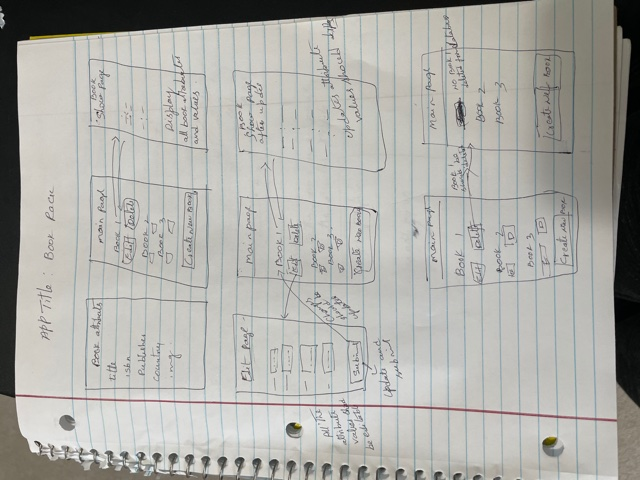
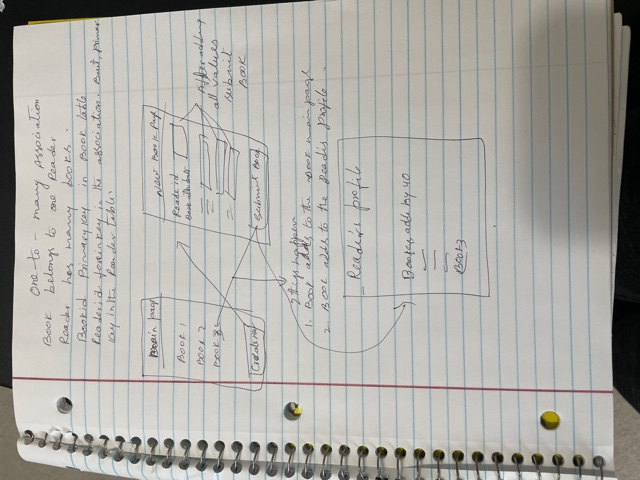

# Project Overview
## Unit 2 project: Book Rack full stack application
- Problem: I have a huge collection of books in my house and want to organize in one place.
- General App Idea/Purpose: An app that allows me to organize it all in one place.
- Who would use it: Book readers/collectors of my family.

## Project Links
- GitHub Repository: https://github.com/sp53852/Unit2-BookRack-app
- Deployment: https://bookreaderssharmila.herokuapp.com/books

## Wireframes
- 
- 

## Requirements
## Technical Requirements
MVP - Full stack application - Book Rack App

### Technologies Used
- Node.js, Express, EJS 
- JavaScript, HTML and CSS
- REST, CRUD
- Postgres
- Sequelize Associations

### Dependencies
- package.json
    - ejs
    - express
    - method_override
    - sequelize
    - sequelize-cli

### MVC File Structure
- Models: book.js and reader.js
- Views: book views( index.ejs, show.ejs,new.ejs and edit.ejs), readers(index.ejs, Signup.ejs,login.ejs  and profile.ejs)
- Controllers: booksController, readersController

### User Stories
1. As a user, I want to set up server with Node.js and Express JS, so that server is up and running for bookrack app.
- Acceptance Criteria: BookRack app directory should be created in the file system. In Terminal, should run npm init to initialize book rack app and to create package .json. Install npm express. Create a file called server.js. Inside of this file,Import express library. Run the app on port 3000. Setup basic get route. In terminal, use nodemon to restart your sever when your code changes.Create .gitignore file and tell git to ignore node_modules directories so that they don't get added accidentally.

2. As a user, I want to set up and connect database to bookrack app.
- Acceptance Criteria: should be able to add array variable of books objects in server.js.

3. As a user, I want to create get routes/ get API's, which will display books data as json in the browser.
- Acceptance Criteria: Create get routes - all objects, object by id, show details of the object. Create routes and place routes in correct order (more specifc comes before less specific(with params). 

4.  As a user, I want to set up a views to display data in views rather than displaying json
- Acceptance Criteria: Install ejs package. views should display the data as expected.

5. As a user, I want to add rest of the REST full routes and CRUD functionality so that I can get and use CRUD for my app.
- Acceptance Criteria: All 7 RESTfull routes and CRUD functionality should work as expected.

6. As a user , I want to add models, Controller/s and router to bookrack app so that it can be MVC compliant.
- Acceptance Criteria: Controllers and models should be created. Import and export the necessary files, folders and /or libraries.
   Router should be created in the app. Import and export the necessary files, folders and /or libraries.
   Refactor server.js and move all the API's into the controller and routes. 
   All the routes and API's should work as expected.

7. As a user, I want to sequelize the app, so that I can sequelize the data for bookrack app.
- Acceptance Criteria: Sequelize should create config, models, migrations and seeders files .
   development environment should be configured.

8. As a user I want to generate sequelize model, squelize db, so that I can specify the attributes for the model. 
- Acceptance Criteria: table created in postgres with all the columns specified.

9. As a user I want to generate sequelize seed file and seed all the data into postgres table, so that I can use the data for the app.
- Acceptance Criteria: empty seed file should be generated. filled in seed file data should be added to the table in db.

 10. As a user, I want to update controller with sequelize model object, sequelize queries and views, so that I can use 
- Acceptance Criteria:  all the routes and CRUD functionality should work as expected.
   
11. As a user, want to add association between Book and Reader, so that reader can own mutiple books and book belongs to one owner.
- Acceptance Criteria: should be able to add new column to the book table. and migrate, seed data to the table. 

12. As a user, I want to add associations to both book and reader table, so that I can update both controllers with other model.
- Acceptance Criteria:sequelize Association (hasMany/belongsTo) between Book and Reader should work as expected. All routes and API's should work as expected. 

### Code Snippet
- router.post("/", (req, res) => {
    Book.create(req.body).then((newBook) => {
      res.redirect("/books");
    });
  });

### Future Improvements
1. Would like to add manay to many association between Book and Author.
2. Would like to add encrypted passwords & an authorization flow for sign up/log in functionality.